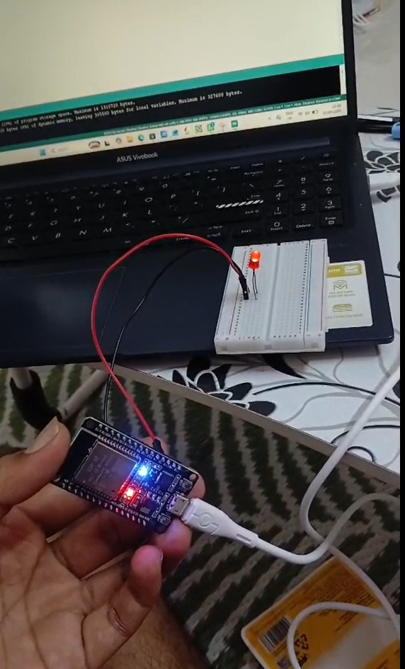

# ESP32 LED Blink and Button Control

## 📌 Project Overview

This is a beginner-level ESP32 project demonstrating basic GPIO programming using an LED and a push button.

The project includes:

1. LED Blinking using ESP32 GPIO
2. LED Control using a Push Button

## 🛠️ Components Used

- ESP32 Development Board
- 5mm LED
- Push Button
- 220Ω Resistor
- Breadboard
- Jumper Wires
- USB Cable

## 🔹 Project 1: LED Blink

The LED is connected to GPIO 2 of the ESP32.

The LED turns ON for 1 second and OFF for 1 second continuously.

### GPIO Connection

| ESP32 Pin | Component |
|-----------|-----------|
| GPIO 2 | LED through 220Ω resistor |
| GND | LED cathode |

## 🔹 Project 2: LED Control Using Button

The push button is connected to GPIO 4.

The ESP32 internal pull-up resistor is used with `INPUT_PULLUP`.

### GPIO Connections

| ESP32 Pin | Component |
|-----------|-----------|
| GPIO 2 | LED through 220Ω resistor |
| GPIO 4 | Push Button |
| GND | LED and Push Button |

### Working

- Button Pressed → LED ON
- Button Released → LED OFF

## ⚙️ Working Principle

The ESP32 is programmed to configure GPIO 2 as a digital output and GPIO 4 as a digital input.

When the button is pressed, GPIO 4 reads LOW because the button connects the pin to GND. The ESP32 then turns ON the LED connected to GPIO 2.

When the button is released, the internal pull-up keeps GPIO 4 HIGH, so the LED turns OFF.

## 💻 Programming Concepts

This project demonstrates:

- ESP32 GPIO
- Digital Input
- Digital Output
- `pinMode()`
- `digitalRead()`
- `digitalWrite()`
- `INPUT_PULLUP`
- `delay()`
- Basic Embedded C/C++ programming

## 📂 Project Files

- `LED_Blink.ino` – LED blinking program
- `LED_Button.ino` – Button-controlled LED program
- `ESP32_LED_Circuit.jpg` – Project circuit image

## 📷 Project Setup

## 🎯 Learning Outcome

Through this project, I learned the fundamentals of ESP32 GPIO programming and basic interfacing of input and output devices.

## 🔮 Future Improvements

- Add PWM-based LED brightness control
- Interface an OLED display
- Add sensors
- Control multiple LEDs
- Add Wi-Fi-based LED control
- Develop an IoT-based application

## 👨‍💻 Author

**Sahil Sali**

Electronics and Telecommunication Engineering Student

Interested in Embedded Systems and IoT.
